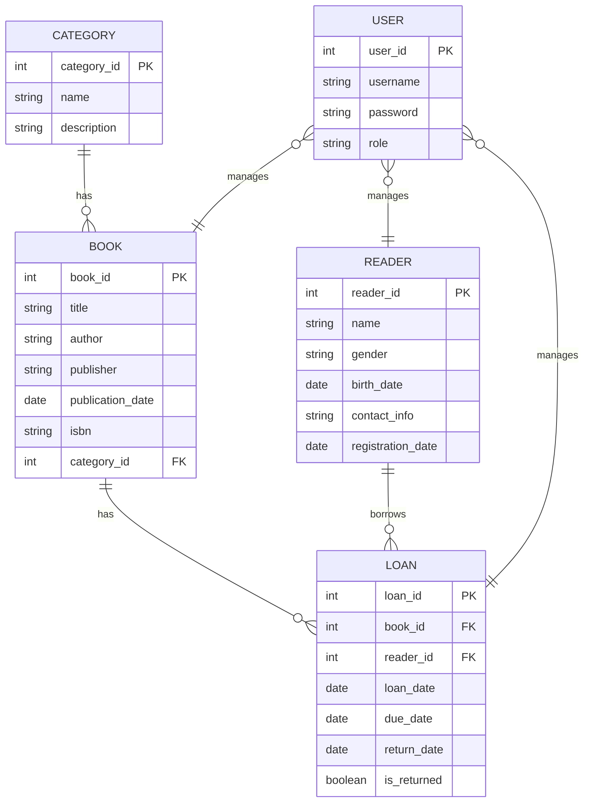

```mermaid
erDiagram
    CATEGORY {
        int category_id PK
        string name
        string description
    }
    BOOK {
        int book_id PK
        string title
        string author
        string publisher
        date publication_date
        string isbn
        int category_id FK
    }
    READER {
        int reader_id PK
        string name
        string gender
        date birth_date
        string contact_info
        date registration_date
    }
    LOAN {
        int loan_id PK
        int book_id FK
        int reader_id FK
        date loan_date
        date due_date
        date return_date
        boolean is_returned
    }
    USER {
        int user_id PK
        string username
        string password
        string role
    }

    CATEGORY ||--o{ BOOK : has
    BOOK ||--o{ LOAN : has
    READER ||--o{ LOAN : borrows
    USER }o--|| BOOK : manages
    USER }o--|| READER : manages
    USER }o--|| LOAN : manages
```